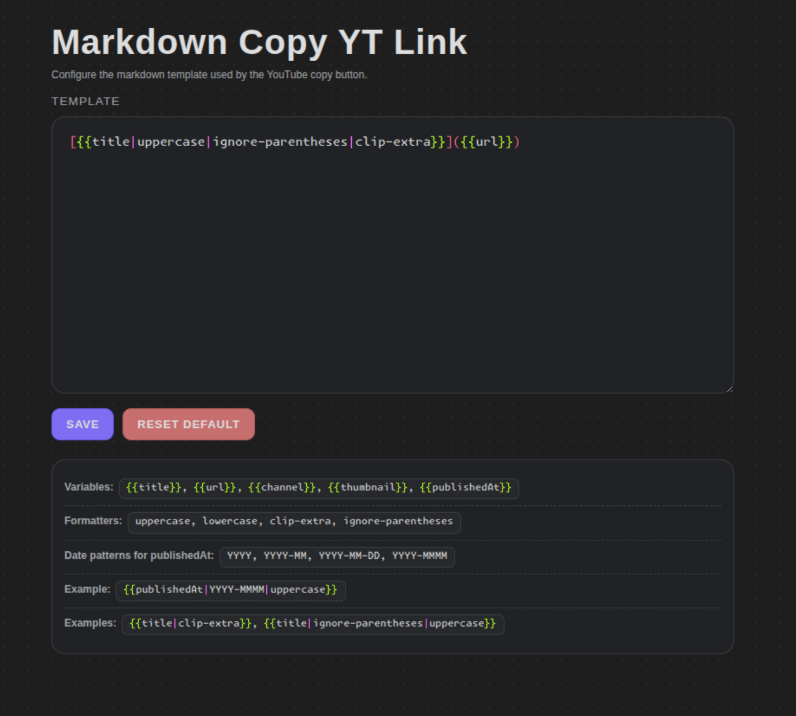

# Markdown Copy YT Link Extension



In YT:


Chrome extension for YouTube that helps copy markdown-formatted links quickly.

## Requirements

- Google Chrome or another Chromium-based browser

## Install (Load Unpacked)

1. Download or clone this repository.
2. Open Chrome and go to `chrome://extensions`.
3. Enable **Developer mode** (top-right toggle).
4. Click **Load unpacked**.
5. Select this project folder:
   - `markdown-copy-yt-link-extension/src`
6. Confirm the extension appears in your extensions list.

## Use the Extension

1. Open any YouTube page (`https://www.youtube.com/*`).
2. Click the extension action in the browser toolbar.
3. Paste the copied markdown link where you need it.

## Optional: Type Check

If you want to run TypeScript checks for editor/type safety:

```bash
npm install
npm run typecheck
```

## Project Files

- `manifest.json`: extension configuration (Manifest V3)
- `content.js`: logic injected into YouTube pages
- `background.js`: background service worker
- `options.html` + `options.js`: extension options UI

## Credits

- Font with built-in syntax highlighting inspiration and source:
  [GlyphDrawing.Club - Font with Built-In Syntax Highlighting](https://blog.glyphdrawing.club/font-with-built-in-syntax-highlighting/)
